# Despliega tu segunda aplicación con Docker (Snapdrop)

### 1. Ejercicio: Despliega el proyecto de docker compose y responde a las siguientes preguntas.

1. Snapdrop se trata de una aplicación para transferir archivos entre equipos a través de la red, averigua tu ip y trata de transferir archivos con algún compañero de clase, ambos teneis que conectaros al mismo servidor. Muestra una captura de la aplicación Snapdrop en el momento de recibir un archivo.

Por ejemplo, la dirección de este equipo es:
`INF200615-8GELA.zornotzalh.eus`
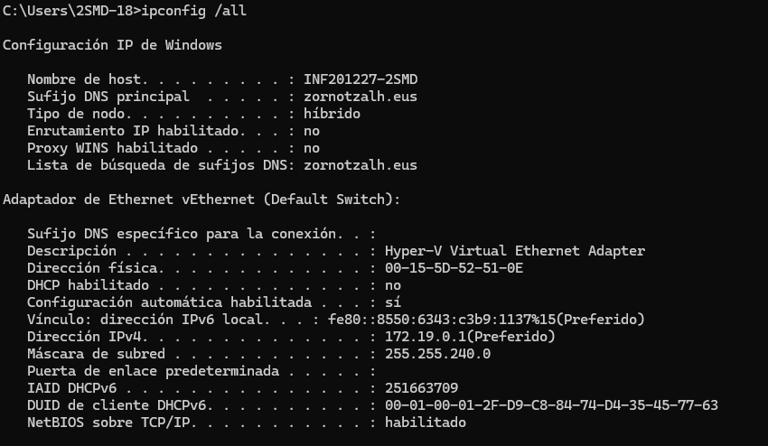
2. ¿Que puertos expone esta aplicacion? ¿Sabrías decirme para que protocolos e usan estos puertos?
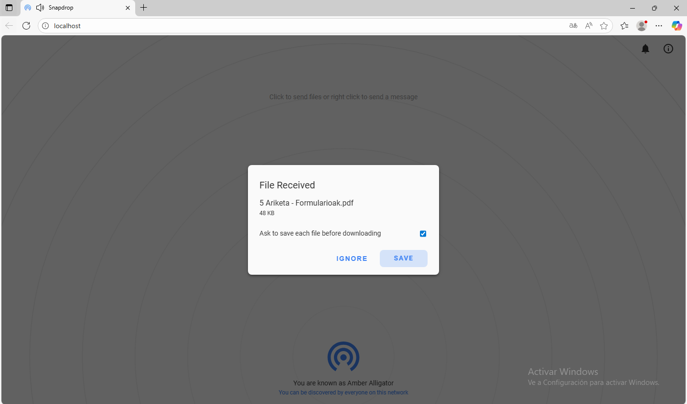
3. ¿Cuantos contenedores incluye este proyecto?
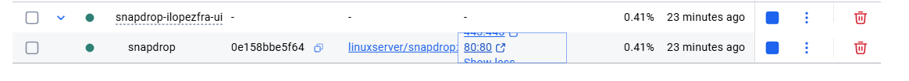
4. ¿Has notado cambios en la carpeta de tu proyecto al desplegar la aplicación? Indica cuales.

5. Cuando termines de responde a todas las preguntas. Haz commit de los cambios realizados con el mensaje.

1. Contenedores
¿Dónde podemos ver los contenedores en ejecución en la aplicación Docker Desktop? (Captura de pantalla)
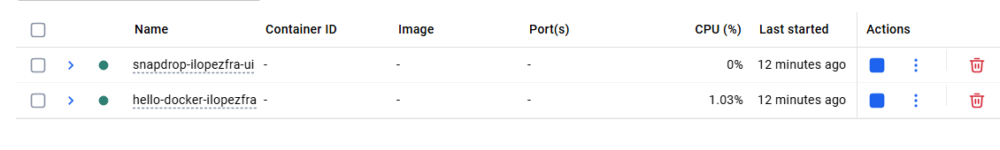
Para ver los contenedores en ejecución desde la terminal se utiliza el comando docker ps. Ejecútalo. (Captura de pantalla)
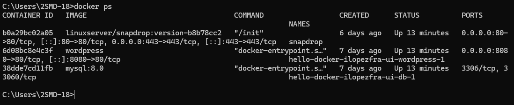
¿Qué muestra el comando docker container?
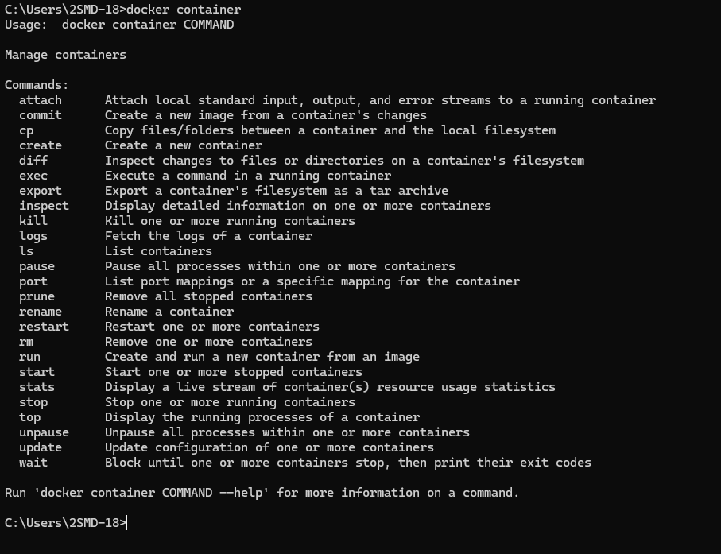
¿Qué muestra el comando docker container ls?
 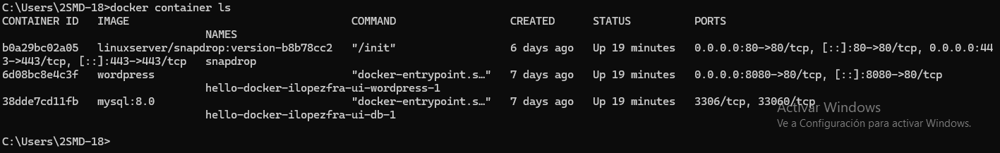
2. Imágenes
¿Dónde podemos ver las imágenes descargadas en la aplicación Docker Desktop? (Captura de pantalla)
¿Qué muestra el comando docker images?
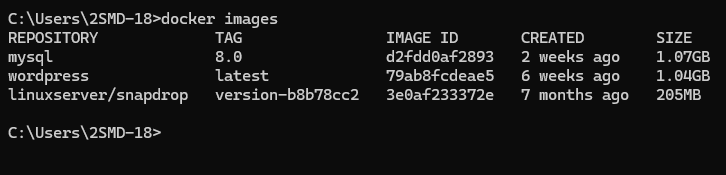
¿Qué muestra el comando docker image ls?
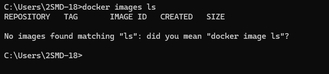
3. Volúmenes
¿Dónde podemos ver los volúmenes que tenemos en la aplicación Docker Desktop? (Captura de pantalla)
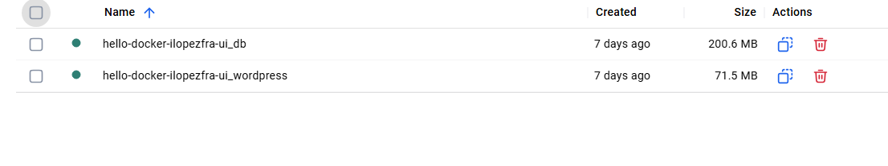
¿Qué podemos ver si accedemos a uno de los volúmenes en Docker Desktop? (Captura de pantalla)
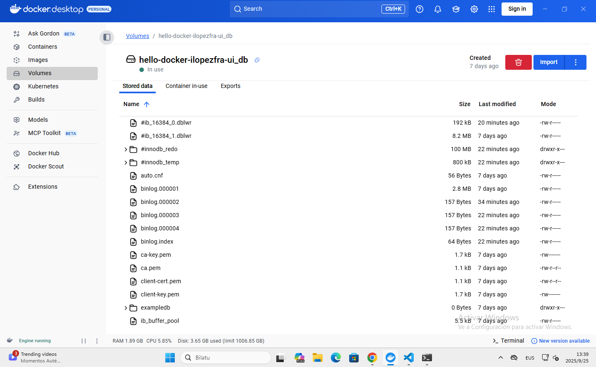
¿Qué muestra el comando docker volume?
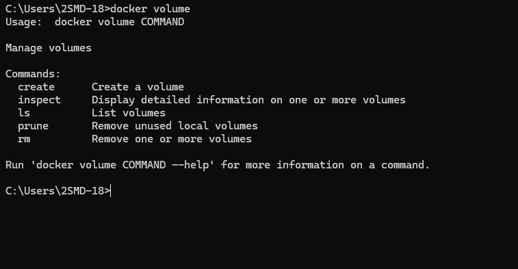
¿Qué muestra el comando docker volume ls?
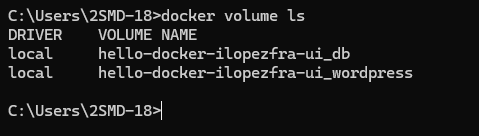
4. Gestión de contenedores
Si accedemos a un contenedor, veremos las siguientes pestañas. Las más importantes son Logs, Exec y Files. Explica para qué crees que sirve cada una.
Pestañas de un contenedor en Docker Desktop

Si queremos ejecutar comandos dentro de un contenedor, podemos usar Docker Desktop o el comando docker exec.
Para abrir un terminal podemos ejecutar el programa bash con el parámetro -it (t para terminal e i para Standard Input):
docker exec -it <NOMBRE_DEL_CONTENEDOR> bash
Ejecuta el comando y muestra una captura de pantalla del terminal dentro del contenedor.
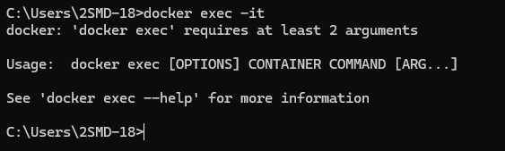
Apaga todos los contenedores de este proyecto con el comando docker compose down. (Captura de pantalla)
📤 Finalmente, entrega la tarea con los siguientes comandos (ejecutar en la raíz del proyecto):
git add --all

git commit -m "readme modificado"

git push